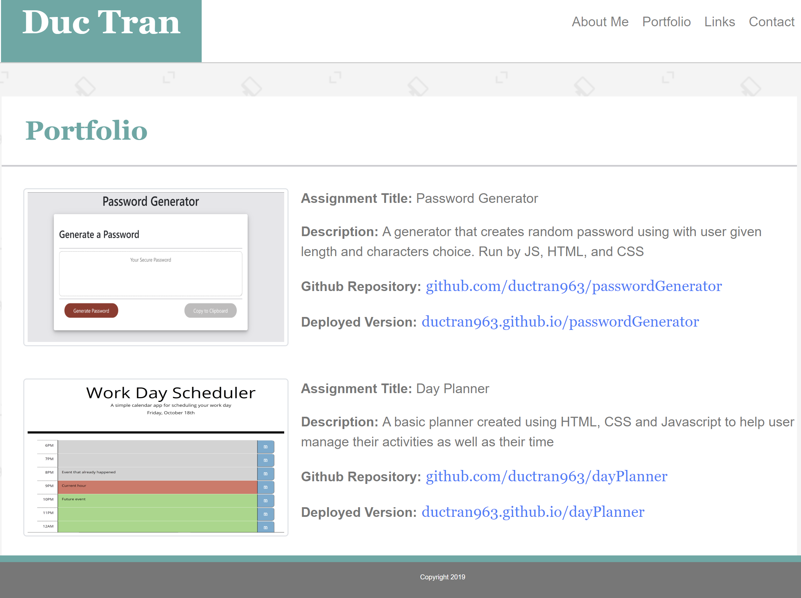

# Professional Meterials

#### Purpose

To update your portfolio with your project as well as homework assignments. ALso, polish your website and add links your resume, github profile, deployed projects/assignments and update your github profile page and Linkedln.

#### Functionality

The functionality of this project is to get us ready to be employee competitive as majority of these project will be part of our resume when we are applying for jobs in the future.

Link to github page: https://ductran963.github.io/updatedPorfolio/

Updated Portfolio image:

